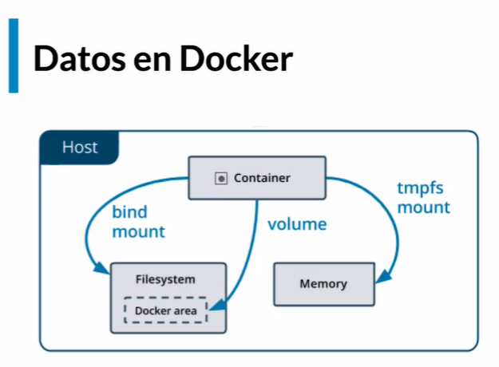

## Docker

[Documentation](https://docs.docker.com/)

### What is a container?

Now that you’ve run a container, what is a container? Simply put, a container is a sandboxed process on your machine that is isolated from all other processes on the host machine. That isolation leverages kernel namespaces and cgroups, features that have been in Linux for a long time. Docker has worked to make these capabilities approachable and easy to use. To summarize, a container:

1. is a runnable instance of an image. You can create, start, stop, move, or delete a container using the DockerAPI or CLI.
2. can be run on local machines, virtual machines or deployed to the cloud.
3. is portable (can be run on any OS)
4. Containers are isolated from each other and run their own software, binaries, and configurations.

* [Docker run](https://docs.docker.com/engine/reference/commandline/run/)
* [Docker ps](https://docs.docker.com/engine/reference/commandline/ps/)
* [Docker exec](https://docs.docker.com/engine/reference/commandline/exec/)
* [Docker stop](https://docs.docker.com/engine/reference/commandline/stop/)
* [Docker rm](https://docs.docker.com/engine/reference/commandline/rm/)
* [Docker logs](https://docs.docker.com/engine/reference/commandline/logs/)

```bash
# Show the Docker version information
$ docker --version

# Display system-wide information
$ docker info
```

```bash
# Run a command in a new container
$ docker run [OPTIONS] IMAGE [COMMAND] [ARG...]
$ docker run ['Image']

# The -it instructs Docker to allocate a pseudo-TTY connected to the container’s stdin; 
# creating an interactive bash shell in the container.
$ docker run -it ['Image']
# (--detach , -d) Run container in background and print container ID
$ docker run -it -d ['Image'] tail -f /dev/null

# (--publish , -p) 
$ docker run --name ['Any name'] -p ['Port host machine']:['Container port']

```

```bash
# List containers
$ docker ps [OPTIONS]
$ docker ps -a

# Fetch the logs of a container
$ docker logs [OPTIONS] CONTAINER
$ docker logs ['Container ID/Name']
# (--follow , -f) Follow log output
$ docker logs --tail 10 -f ['Container ID/Name']

# Get Pid from main process from container
$ docker inspect --format '{{.State.Pid}}' ['Container ID/Name']
$ kill ['Pid'] # You could kill the main process from container with Pid

# Inside the container
> ps
> ps -aux
```

```bash
# Run a command in a running container
$ docker exec -it ['Container ID/Name'] bash

# Return low-level information on Docker objects
$ docker inspect [OPTIONS] NAME|ID [NAME|ID...]
```

```bash
# Stop one or more running containers
$ docker stop ['Container ID/Name']

# Remove one or more containers
$ docker rm ['Container ID/Name']
# Stop and remove one or more containers
$ docker rm -f ['Container ID/Name']

# Remove all stopped containers
$ docker container prune [OPTIONS]
```

## Bind mounts

[Use bind mounts](https://docs.docker.com/get-started/06_bind_mounts/)

```bash
# Create directory to save data
$ mkdir mongo_data_bind_mount

$ docker run -d --name db -v /home/oem/Development/Learning/Docker/docker-experiments/mongo_data:/data/db mongo
$ docker exec -it db bash 
> mongo
~ show dbs
~ use data_base
~ db.users.insert({"nombre": "Jaiden"})
WriteResult({ "nInserted" : 1 })
~ db.users.find()
{ "_id" : ObjectId("61c81fe0bb44bd606e57136f"), "nombre" : "Jaiden" }
~ exit
> exit
```

## Volumes

[Use volumes](https://docs.docker.com/storage/volumes/)

```bash
$ docker volume ls
$ docker volume create data_volume
$ docker run -d --name db --mount src=data_volume,dst=/data/db mongo
$ docker inspec db 
$ docker exec -it db bash 
> mongo
~ show dbs
~ use data_base
~ db.users.insert({"nombre": "Jaiden"})
WriteResult({ "nInserted" : 1 })
~ db.users.find()
{ "_id" : ObjectId("61c81fe0bb44bd606e57136f"), "nombre" : "Jaiden" }
~ exit
> exit
$ docker volume rm ['Volume name']
```

## Insert and extract files from a container (Docker cp)

[Use docker cp](https://docs.docker.com/engine/reference/commandline/cp/)

```bash
# Insert files
$ touch test.txt
$ docker run -d --name copytest ubuntu tail -f /dev/null
$ docker exec -it copytest bash # Enter into container
> mkdir testing 
> exit
$ docker cp tes.txt copytest:/testing/test_copied.txt
$ docker exec -it copytest bash # Enter into container
> cd testing/
> ls -la
< -rw-r--r-- 1 1000 1000    0 Feb  2 15:58 test_copied.txt
> exit
# Extract files
$ docker cp copytest:/testing directory_extracted # Directories
$ docker cp copytest:/testing/test_copied.txt file_extracted.txt # Files
```



## Images

* [Images](https://docs.docker.com/engine/reference/commandline/images/)
* [Dockerfile](https://docs.docker.com/engine/reference/builder/)
 
```bash
$ docker image ls
$ docker pull ubuntu:20.04
$ mkdir ubuntu
$ touch ubuntu/Dockerfile
```

```Dockerfile
FROM ubuntu:latest

RUN touch /usr/src/test/dockerfile.txt
```

```bash
$ cd ubuntu
$ docker build -t ubuntu:test_ubuntu . # Use by default Dockerfile into directory
# Create container with previus image
$ docker run -it ubuntu:test_ubuntu
> ll
> cd /usr/src/test
> ls -la
> exit
$ docker images ls
# Generate a  new tag fro the same image
$ docker tag ubuntu:test_ubuntu jaidenmeiden/ubuntu:test_ubuntu
$ docker login
$ docker push jaidenmeiden/ubuntu:test_ubuntu

```

## Layers system

[wagoodman/dive](https://github.com/wagoodman/dive)

```bash
$ docker history <image_name>
$ dive <image_tag>

```

## Command line reference (Docker CLI)

* [Docker run](https://docs.docker.com/engine/reference/run/)
* [Docker build](https://docs.docker.com/engine/reference/commandline/build/)
* [Docker pull](https://docs.docker.com/engine/reference/commandline/pull/)
* [Docker push](https://docs.docker.com/engine/reference/commandline/push/)
* [Docker commit](https://docs.docker.com/engine/reference/commandline/commit/)

## Using docker to develop applications

[Docker node example](https://github.com/platzi/docker.git)

```bash
$ git clone https://github.com/platzi/docker.git
# Review inner files
$ ls -la
> ...
> docker-compose.yml
> Dockerfile
> ...

# Build images
$ docker build -t node_test .

# Review images
$ docker image ls
> ...
REPOSITORY            TAG           IMAGE ID       CREATED              SIZE
node_test             latest        7e40a5bf7cd3   About a minute ago   931MB
> ...

# Run container
$ docker run --rm -p 3000:3000 node_test
Server listening on port 3000!

```

Review browser
http://localhost:3000/

